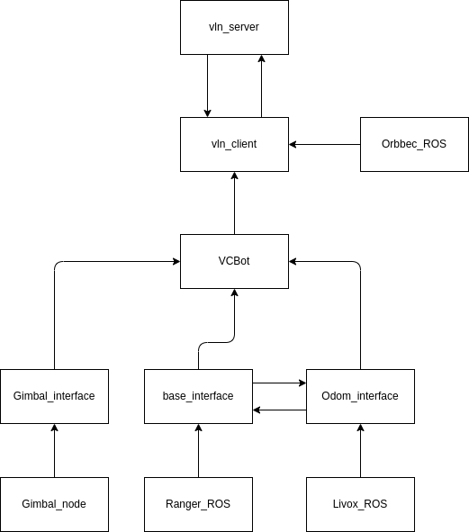

# m2g_vln_car

This project is based on the project which is https://github.com/MrZihan/Sim2Real-VLN-3DFF. 

Thanks so much for MrZihan of the project.

Also this project is not only my project, but also the project of the team of the VLN in HKUST-GZ.

# vln_car project overview



# Device recommendation

1. Intel NUC
2. Intel Realsense D435i
3. Orbbec 336L
4. Livox Mid-360
5. C40 Gimbal (Campany BaoShiLai in taobao)


# Step by step to run this project

## Open CAN port

```
bash /home/uav/m2g_vln_car/vln_car/src/vln/scripts/usb2can.bash 

ifconfig can0
```

If the can 0 is up, then is fine.

## Open the ROS topic of all the sensors

Using different terminals to open the following commands.

```
roslaunch vln orbbec_camera.launch

roslaunch vln fast_lio.launch

roslaunch ranger_base ranger_mini_v2.launch
```

## Open the VLN client

```
rosrun vln vln_client.py
```

## Open the VLN server

Open your labs server, and go to the VLN server code folder, and run the following command.

```
cd /home/lg1/peteryu_workspace/Sim2Real-VLN-3DFF/Server_Code

bash ./vln.bash
```


# Some notes :)

## For the D435i (Deplicated)

If you are installing on multiple robots, you may find it convenient to build the source code using the backend method. This requires an internet connection but is not dependent on Linux versions or kernel versions and does not require patching. Once you have extracted a source-code zip file, you can build the SDK from source with the simple method below:

    Go to the Librealsense root directory of the extracted folder and create a Build folder, and then change to that created folder using the command below:

mkdir build && cd build

    Whilst in the Build folder, run the CMake command below:

cmake ../ -DFORCE_RSUSB_BACKEND=true -DCMAKE_BUILD_TYPE=release -DBUILD_EXAMPLES=true -DBUILD_GRAPHICAL_EXAMPLES=true

    Whilst still in the Build folder, run the CMake command below:

sudo make uninstall && make clean && make -j8 && sudo make install


dpkg -l | grep "realsense" | cut -d " " -f 3 | xargs sudo dpkg --purge